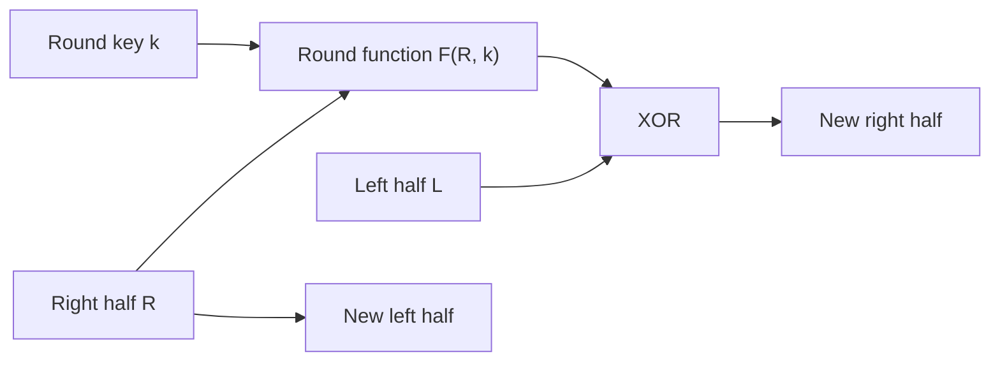

# Cryptography Labs

Cryptography coursework in **SageMath and Python** from Vilnius University, Faculty of Mathematics and Informatics, 2024. The Sage worksheets were written in the browser using **SageMathCell**. The material covers classical ciphers, rotor and Feistel constructions, shift registers, statistical analysis of bit streams, knapsack encryption, RSA and ElGamal signatures.

The repository contains seven standalone exercise scripts, supporting worksheet fragments and recorded manual solutions. Source files are separated from the original mixed notes, with the classroom algorithms and exercise data retained.

## Exercises

The numbers follow the saved practice and week labels. They are intentionally not renumbered into a new sequence.

| Practice | Topic | Language | Available material |
| --- | --- | --- | --- |
| [1](docs/recorded-notes.md#practice-1-classical-ciphers) | Scytale, permutations, Fleissner grille and Delastelle cipher | Manual work | Ciphertext layouts, grids and partial answers |
| [3](labs/03-caesar-analysis/) | Caesar frequency analysis | Python | Script scoring candidate shifts in the Lithuanian alphabet |
| [4](labs/04-enigma/) | Enigma-style rotor operations | SageMath-style worksheet | Preserved rotor fragments and answer notes |
| [5](labs/05-feistel/) | Two-round Feistel construction | SageMath | Decryption script, key-search fragment and recorded answers |
| [6](docs/recorded-notes.md#practice-6-recorded-plaintexts) | Recorded cipher answers | Manual work | Four plaintext records; implementation not present |
| [8](labs/08-lfsr/) | LFSR and known-plaintext analysis | SageMath | Register helpers, partial row reduction and an A5/1-style exercise |
| [9](labs/09-randomness-tests/) | Bit-stream statistics | SageMath | Poker, frequency, bit-pair and autocorrelation-style tests |
| [10](labs/10-knapsack/) | Modular knapsack decoding | SageMath | Decoding script and saved numerical work |
| [11](labs/11-rsa/) | RSA | SageMath | Private-key decryption and common-modulus scripts; factorization notes |
| [13](labs/13-elgamal/) | ElGamal signatures and encryption | Python | Signature verification, reused-nonce analysis, decryption and signing |
| [14](docs/recorded-notes.md#practice-14-numerical-answers) | Unidentified numerical exercise | Recorded answers | Three numerical answers and a value of `p` |

The collection represents **11 numbered practice labels**, with different levels of preserved detail. It is not a claim that all classes or assignments from the course are included. See the [coverage record](docs/coverage.md) for source files and gaps.

## Getting started

### Requirements

- **SageMath** for `.sage` files. Its preparser, exact arithmetic and mathematical functions are part of these exercises. Follow the [official installation guide](https://doc.sagemath.org/html/en/installation/index.html) for your system.
- **Python 3.8 or newer** for the two `.py` scripts. They use only the standard library; ElGamal uses modular inverses through three-argument `pow`.

No separate `pip` dependencies are required for the Python scripts. The SageMath runtime supplies the mathematical dependencies used by the `.sage` files.

```sh
git clone https://github.com/lukamaga/cryptography-labs.git
cd cryptography-labs
```

### Run a standalone exercise

Run a command from the repository root:

| Exercise | Command |
| --- | --- |
| Caesar shift scoring | `python3 labs/03-caesar-analysis/caesar_frequency.py` |
| Two-round Feistel decryption | `sage labs/05-feistel/feistel_decrypt.sage` |
| Bit-stream statistics | `sage labs/09-randomness-tests/randomness_tests.sage` |
| Modular knapsack decoding | `sage labs/10-knapsack/knapsack_decode.sage` |
| RSA with a supplied private key | `sage labs/11-rsa/rsa_decrypt.sage` |
| RSA common-modulus exercise | `sage labs/11-rsa/common_modulus.sage` |
| ElGamal reused-nonce exercise | `python3 labs/13-elgamal/elgamal_nonce_reuse.py` |

The scripts use the fixed datasets and parameters in their source files and print to the console. Original comments, alphabets and output labels are retained. Each lab README explains the available inputs, the calculation and the interpretation of the output.

The Enigma and LFSR folders contain worksheet material whose full decryption procedures were not preserved. Their READMEs identify the available helpers and the missing steps.

### Use SageMath in a browser

For a standalone `.sage` exercise, open [SageMathCell](https://sagecell.sagemath.org/), paste the entire source file into the input and select **Evaluate**. Keep its definitions and exercise data together in the same evaluation.

For a local browser notebook, start Sage's Jupyter interface:

```sh
sage -n jupyter
```

Select the **SageMath kernel**. A plain Python kernel does not apply Sage's preparser. See the [Sage command-line reference](https://doc.sagemath.org/html/en/reference/repl/options.html) for the supported launch options.

### Why `.sage` and `.py` are separate

| Expression | SageMath with preparsing | Ordinary Python |
| --- | --- | --- |
| `2^3` | Exponentiation: `8` | Bitwise XOR: `1` |
| `3^^2` | Bitwise XOR: `1` | Invalid syntax |
| `2/3` | Exact rational number | Floating-point division |

String contents are not preparsed. In the Feistel exercise, the outer `^^` is Sage XOR, while `^` inside the fixed expression passed to Python's `eval` is also XOR. Changing all carets to one operator would change the program. The [Sage FAQ](https://doc.sagemath.org/html/en/faq/faq-usage.html#how-do-i-use-the-bitwise-xor-operator-in-sage) documents this distinction.

## Selected methods

### A Feistel round

The saved two-round exercise uses the transformation

$$
(L,R)\longmapsto\bigl(R,L\oplus F(R,k)\bigr).
$$



The script applies two rounds with the recorded keys and swaps the final pair before converting it to characters. The separate key-search worksheet is preserved as a fragment, with its unresolved variable described in the [lab notes](labs/05-feistel/).

### RSA with a common modulus

For the supplied exponents, the saved coefficients satisfy

$$
(-7)\cdot31+2\cdot109=1.
$$

With the same message encrypted under the same modulus, the exercise combines the ciphertexts as

$$
m\equiv c_a^{-7}c_b^2\pmod n.
$$

The negative exponent requires an inverse of $c_a$ modulo $n$. The implementation uses Sage's `power_mod` and the original text-to-number convention. [RSA documentation](labs/11-rsa/)

### Reusing an ElGamal signing nonce

The Python exercise starts from two supplied signatures with the same first component. It checks the signatures, searches for the reused nonce and private exponent, decrypts the supplied ciphertext and signs the recovered message.

The signing relation is

$$
m\equiv a\gamma+k\delta\pmod{p-1},
$$

where $a$ is the private exponent and $k$ is the signing nonce. Subtracting two relations eliminates $a\gamma$:

$$
m_1-m_2\equiv k(\delta_1-\delta_2)\pmod{p-1}.
$$

The script contains a candidate-search procedure for its supplied exercise parameters. Its lab README describes that scope and preserves the instructor credit attached to the encoding helpers. [ElGamal documentation](labs/13-elgamal/)

## Notes and source record

- [Coverage](docs/coverage.md) lists what was preserved for each numbered practice.
- [Recorded manual notes](docs/recorded-notes.md) retain the classical-cipher work, practice 6 plaintexts and practice 14 numerical answers.
- Per-lab READMEs distinguish complete source blocks from partial notebook cells and historical answers.
- [Attribution](ATTRIBUTION.md) records the course context and source handling.
- [Source manifest](docs/provenance.json) maps published files to the original archive and documents extraction changes.

The statistics exercise retains its original bit-packing and lag-index conventions, documented in its [README](labs/09-randomness-tests/README.md). Historical answers are identified as recorded notes; they are not presented as newly generated output. The source files were inspected and organized without executing the coursework programs.

## Author and course

Lukaš Patrik Magalinski, Vilnius University, Faculty of Mathematics and Informatics.

Course: *Kriptografija ir informacijos sauga* (Cryptography and Information Security), autumn 2024.
